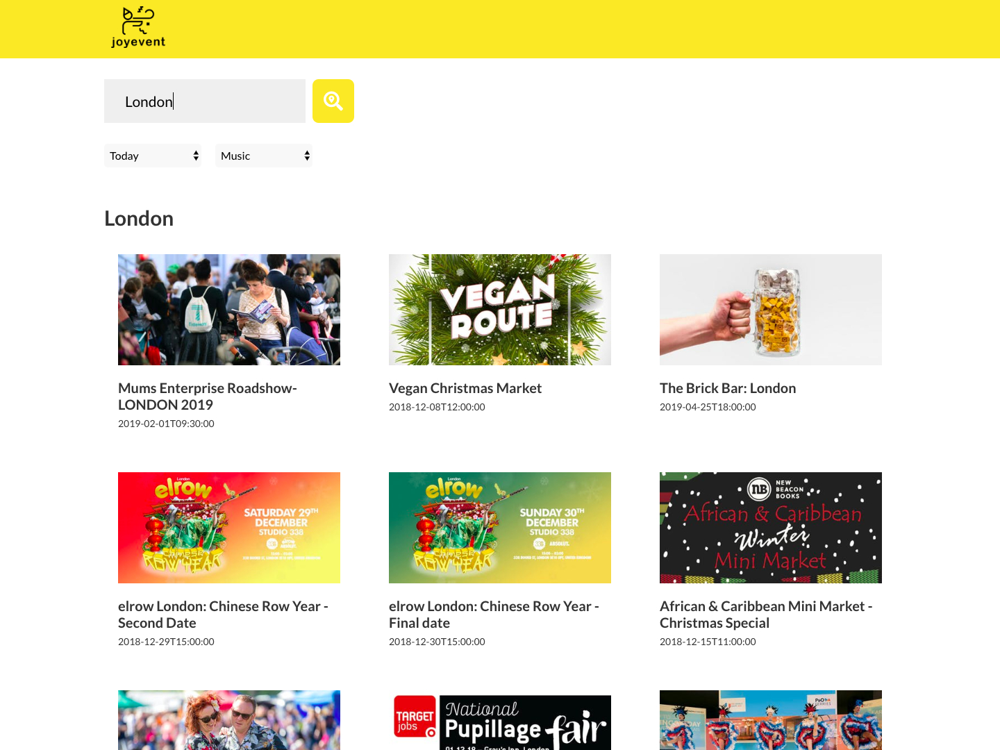

# Joyevent

> Joyevent is the web site to search the event information around the world.



## Table of contents

- [Description](#Description)
- [Getting started](#Getting-started)
- [Features](#Features)
- [Status](#Status)
- [Links](#Links)
- [Contact](#Contact)

## Description

- Joyevent is the web site to search the event information around the world.

- You can search dependes on the keyword, the date, category.

- This project is also made by React.

### Technologies

- HTML5
- CSS3
- JavaScript
- React
- Sass
- BEM
- Webpack
- Babel
- Prettier
- Visual Studio Code
- Markdown

### API

- [Eventbrite API](https://www.eventbrite.com/developer/v3/)

## Getting started

This project was bootstrapped with [Create React App](https://github.com/facebook/create-react-app). What you need to do is just install and start like the code below.
(Remind node is already installed in your computer)

```shell
npm install
npm start
```

the most recent version of this guide [here](https://github.com/facebook/create-react-app/blob/master/packages/react-scripts/template/README.md). It shows you the lists of available scripts.

## Features

- When you input the place It shows you the events near the place.

- Also you can specifically search with the date and category.

## Status

Project is: _still developed_

## Links

- Project homepage: https://joyevent.reiyoshizawa.com/
- Repository: https://github.com/oyyer/joyevent
- Issue tracker: https://github.com/oyyer/joyevent/issues
  - In case of sensitive bugs like security vulnerabilities, please contact
    reiyoshizawa0418@email.com directly instead of using issue tracker. We value your effort
    to improve the security and privacy of this project!
- Related projects:
  - Joy Event: https://github.com/oyyer/visual-translate
  - Visual Translat: https://github.com/oyyer/portfolio-react

## Contact

Feel free to contact me!

- Website - Rei Yoshizawa Portfolio Website (https://www.reiyoshizawa.com/)
- Twitter - @oyyer\_ (https://twitter.com/oyyer_)

[Back To The Top](#Joyevent)
